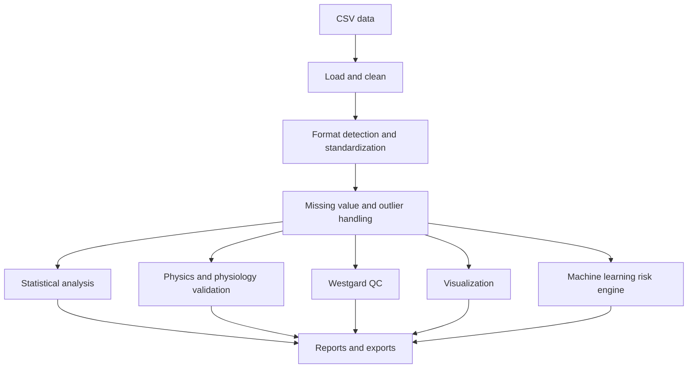

# DBD Hematology–Clinical Chemistry Pipeline

An experimental pipeline for analyzing medical record data from patients with dengue hemorrhagic fever (DHF), with a focus on the relationship between hematocrit (HCT) and albumin. The system combines data cleaning, clinical validation, Westgard quality control, plasma leakage index calculation, statistical analysis, visualization, machine learning, and result export.

> **Status:** experimental research prototype. This system is intended for research, documentation, and engineering demonstration. Its results are not a substitute for professional diagnosis or clinical decision-making.

## Objectives

- Prepare medical record data in a consistent analysis format.
- Remove or flag incomplete data and statistical outliers.
- Check identity, examination-time, clinical-value, and duplicate-record consistency.
- Calculate physiological indicators based on HCT and albumin.
- Evaluate control data using Westgard rules and Levey–Jennings charts.
- Run statistical analysis, visualization, and risk-prediction models.
- Store analysis results and dataset versions for reproducibility.

## System Architecture



## Main Execution Paths

### Recommended modular pipeline

The clearest starting point is [`main.py`](main.py). Its `full_pipeline()` function runs these stages:

1. Load and clean data through [`data/loader.py`](data/loader.py).
2. Run statistical analysis through [`analysis/stats.py`](analysis/stats.py).
3. Check physiological rules and outliers through [`models/physics.py`](models/physics.py).
4. Calculate Westgard QC and generate a chart through [`models/westgard.py`](models/westgard.py).
5. Create an HCT–albumin scatter plot through [`visualization/plots.py`](visualization/plots.py).
6. Train the machine-learning risk engine through [`models/risk_engine.py`](models/risk_engine.py).
7. Export the statistical summary through [`utils/export.py`](utils/export.py).

Run it from the project directory:

```powershell
python main.py
```

`main.py` uses the data path and statistical configuration from [`config/config.py`](config/config.py). Check `DATA_PATH`, column names, and output locations for the local environment before running the pipeline.

### Integrated prototype

[`Trial 2.0.py`](Trial%202.0.py) is a monolithic prototype that combines data processing, NLP/PyTorch, Westgard QC, the physics engine, advanced statistics, machine learning, feature engineering, hyperparameter optimization, dataset versioning, and automated clinical interpretation.

This file is useful for documenting the engineering evolution of the project and for feature experimentation. However, some execution blocks run at module level, and several classes and imports are still duplicated. Therefore, use `main.py` as the primary documented entry point and treat `Trial 2.0.py` as an advanced prototype until its modules are fully consolidated.

## Folder Structure

```text
.
├── main.py                         # Entry point for the modular pipeline
├── Trial.py                        # Earlier experimental version
├── Trial 2.0.py                    # Integrated engineering prototype
├── config/
│   └── config.py                   # Data paths and statistical configuration
├── data/
│   └── loader.py                   # Loading, cleaning, outlier handling, anonymization
├── models/
│   ├── physics.py                  # Leakage index and physiological validation
│   ├── westgard.py                 # Westgard rules and Levey–Jennings chart
│   └── risk_engine.py              # Risk-model training and prediction
├── analysis/
│   └── stats.py                    # Dataset statistical analysis
├── visualization/
│   └── plots.py                    # Analysis visualizations
├── utils/
│   └── export.py                   # Result-summary export
├── guards/
│   ├── guard_manager.py            # Orchestration of all guards
│   ├── identity_guard.py           # Patient identity consistency
│   ├── temporal_guard.py           # Date and time consistency
│   ├── clinical_guard.py           # Clinical-value consistency
│   └── duplicate_guard.py          # Duplicate-record detection
├── plasma_leakage.cpp              # C++ implementation
├── plasma_leakage.hpp              # C++ header
├── bindings.cpp                    # pybind11 bindings
├── CMakeLists.txt                  # CMake build configuration
├── setup.py                        # Python C++ extension build configuration
├── Frontend/Avant.html             # HTML interface skeleton
├── Backend/Avant.js               # JavaScript backend placeholder
├── CSS/Avant.css                   # Interface stylesheet
├── tests                           # Test scripts in the project root
└── data_*.csv                      # Research/sample datasets
```

## System Description

### Data loading and cleaning

`data/loader.py` reads CSV files, removes rows missing `HCT_%` or `Albumin_g/dL`, detects outliers using the IQR method, and filters HCT and albumin measurements taken on the same date when date columns are available.

### Guard system

The `guards/` package provides layered checks for:

- patient identity and attribute consistency;
- examination order and time consistency;
- clinical-value ranges and relationships;
- potentially duplicated records.

`GuardManager` supports `STRICT` and `PERMISSIVE` validation modes and produces summaries of valid records, invalid records, warnings, and errors.

### Physics and physiology engine

[`models/physics.py`](models/physics.py) calculates:

```text
Leakage Index = Hematocrit / Albumin
```

The categories are `Normal`, `Risiko Kebocoran`, and `Kebocoran Plasma`. The same module also checks 3-SD outliers and the HCT–albumin correlation.

### Westgard quality control

[`models/westgard.py`](models/westgard.py) implements the `1-2s`, `1-3s`, `2-2s`, `R-4s`, `4-1s`, and `10-x` rules, then saves a Levey–Jennings chart as `westgard.png`.

### Statistical analysis and visualization

The analysis modules generate statistical summaries and variable-relationship analysis. HCT–albumin scatter plots are provided by the `visualization/` package.

### Machine-learning risk engine

[`models/risk_engine.py`](models/risk_engine.py) trains a risk model using available features such as `Umur_Tahun`, `HCT_%`, and `Albumin_g/dL`. Depending on the implementation and configuration, the model can be exported to ONNX and/or joblib format.

### Trial 2.0 advanced engineering

In addition to the core functionality, `Trial 2.0.py` contains prototypes for:

- PyTorch-based text preprocessing and classification;
- LONG-to-WIDE data transformation and fuzzy parameter-name matching;
- duplicate resolution using probabilistic scores and entity graphs;
- rule-based clinical validation;
- confidence intervals, effect sizes, and bootstrap analysis;
- cross-validation, calibration, and SHAP explainability;
- hyperparameter optimization with RandomizedSearchCV and Optuna;
- polynomial, ratio, and interaction feature engineering;
- hash- and metadata-based dataset versioning;
- automated result interpretation and clinical insight generation.

These advanced features still require validation and integration before they should be considered production-ready.

### C++ plasma leakage extension

`plasma_leakage.cpp`, `plasma_leakage.hpp`, and `bindings.cpp` form a Python extension through pybind11. Build configuration is provided in [`CMakeLists.txt`](CMakeLists.txt) and [`setup.py`](setup.py).

Build with setuptools:

```powershell
python setup.py build_ext --inplace
```

Or with CMake:

```powershell
cmake -S . -B build
cmake --build build --config Release
```

The C++ build is optional when the Python implementation is used as a fallback.

## Data Format

After standardization, the main pipeline expects the following columns:

| Column | Meaning |
|---|---|
| `HCT_%` | Hematocrit percentage |
| `Albumin_g/dL` | Albumin in g/dL |
| `Tanggal_Hematokrit` | HCT measurement date, if available |
| `Tanggal_Albumin` | Albumin measurement date, if available |
| `ID_Pasien` | Anonymous patient identifier, if available |
| `Umur_Tahun` | Patient age, when used by the model |

The pipeline also recognizes LONG format using the `Parameter` and `Hasil` column pair, and can convert it to WIDE format when the transformation functions are used.

## Dependency Installation

Create a virtual environment:

```powershell
python -m venv .venv
.\.venv\Scripts\Activate.ps1
python -m pip install --upgrade pip
```

Core project dependencies include:

```powershell
python -m pip install pandas numpy scipy scikit-learn matplotlib torch rapidfuzz fpdf2 skl2onnx onnxruntime openpyxl
```

Advanced features may require additional packages:

```powershell
python -m pip install networkx pymc optuna boto3 pyyaml statsmodels shap sqlalchemy imbalanced-learn
```

Package versions should be pinned in `requirements.txt` before publishing the project as a reproducible artifact.

## Testing

The root test scripts cover basic behavior, the catalog, fixes, the guard system, imports, and integration. Run them with:

```powershell
python -m pytest -q
```

If `pytest` is not installed:

```powershell
python -m pip install pytest
```

## Generated Outputs

Depending on the execution path, the pipeline may generate:

- `westgard.png`;
- an HCT–albumin scatter plot;
- `results_stats.xlsx`;
- `.onnx` or `.joblib` model files;
- `data_anonymized.csv`;
- a `data_versions/` folder containing datasets and metadata;
- `validation_report.json`;
- analysis log files.

Result files and runtime folders should be added to `.gitignore` when they contain local output or sensitive data.

## Privacy and Data Ethics

- Do not upload patient names, medical record numbers, or direct identifiers to a public repository.
- Use anonymized, synthetic, or properly authorized public data.
- Review CSV files, output files, logs, and metadata before pushing to GitHub.
- Model outputs are research-support indicators and must undergo clinical validation before real-world use.

## Technical Notes and Current Limitations

- `Trial 2.0.py` still contains module-level execution, repeated class definitions, and experimental features.
- `LabPipelineOrchestrator` appears more than once in `Trial 2.0.py`; the last definition can overwrite the earlier one.
- Some advanced dependencies are optional but are currently imported at module startup.
- Cloud upload and parts of the orchestration layer require configuration before use.
- Column-name conventions must remain consistent across the dataset, configuration, pipeline, and model.
- A positive correlation or a plasma leakage index is a rule-based indicator, not a diagnosis.

## License and Credits

Add the project license, dataset source, Python version, dependency versions, and author information before publishing the repository. This documentation describes the code structure and behavior currently available in the project folder.